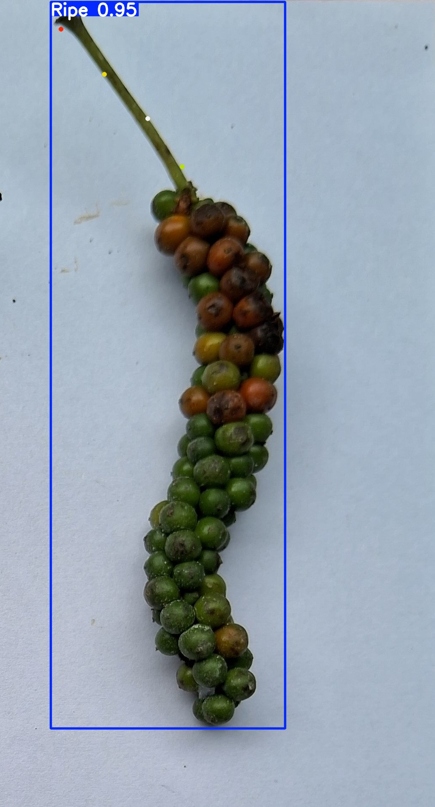

# Ripe Black Pepper Detection using YOLOv8

This repository contains a custom-trained **YOLO-based object detection model** designed to identify **ripe black pepper spikes** for use in autonomous or semi-autonomous harvesting robots (such as the SR9Bot).

The model is trained on real-world data collected from mobile and ESP32 cameras to ensure high accuracy in natural farm environments.

---

## Features

- Detects **ripe pepper spikes** in real time
- Works with **phone camera streams**, USB webcams, or local video
- Fast inference using **YOLOv8 / YOLOv5 architecture**
- Lightweight and deployable on **Raspberry Pi** or laptops
- Perfect for agricultural robotics / smart farming systems

---

## Demo

**Images**
 _Ripe pepper_  _Unripe pepper_

> **Demo video:**  
> [Ripe Detection Demo](demo/ripe_demo.mp4) _Ripe peppers detected_ > [Watch Unripe Detection Demo] (demo/unripe*demo.mp4) \_Unripe peppers detected*

## License

This project is licensed under the MIT License - see the [LICENSE](LICENSE) file for details.
