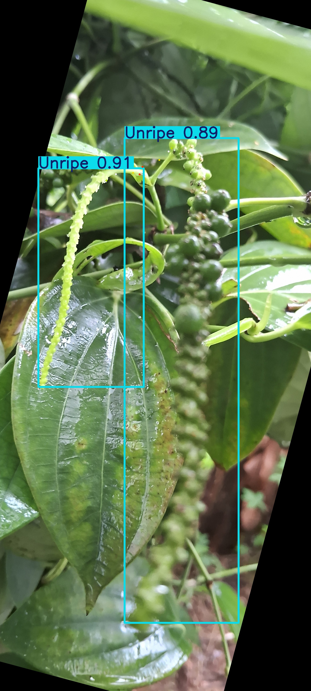
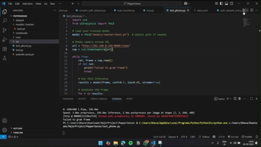
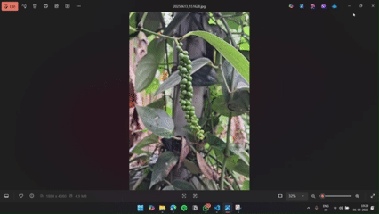

# Ripe Black Pepper Detection using YOLOv8

This repository contains a custom-trained **YOLO-based object detection model** designed to identify **ripe black pepper spikes** for use in autonomous or semi-autonomous harvesting robots (such as the SR9Bot).

The model is trained on real-world data collected from mobile cameras to ensure accuracy in natural farm environments.

## Features

- Detects **ripe pepper spikes** in real time
- Works with **phone camera streams**, USB webcams, or local video
- Fast inference using **YOLOv8 / YOLOv5 architecture**
- Lightweight and deployable on **Raspberry Pi** or laptops
- Perfect for agricultural robotics / smart farming systems

## Demo

**Images**

  
  

<b>Ripe (left) vs Unripe (right)</b>

**Demo video:**  
  
*Ripe peppers detected*

  
*Unripe peppers detected*

## License

This project is licensed under the MIT License - see the [LICENSE](LICENSE) file for details.
